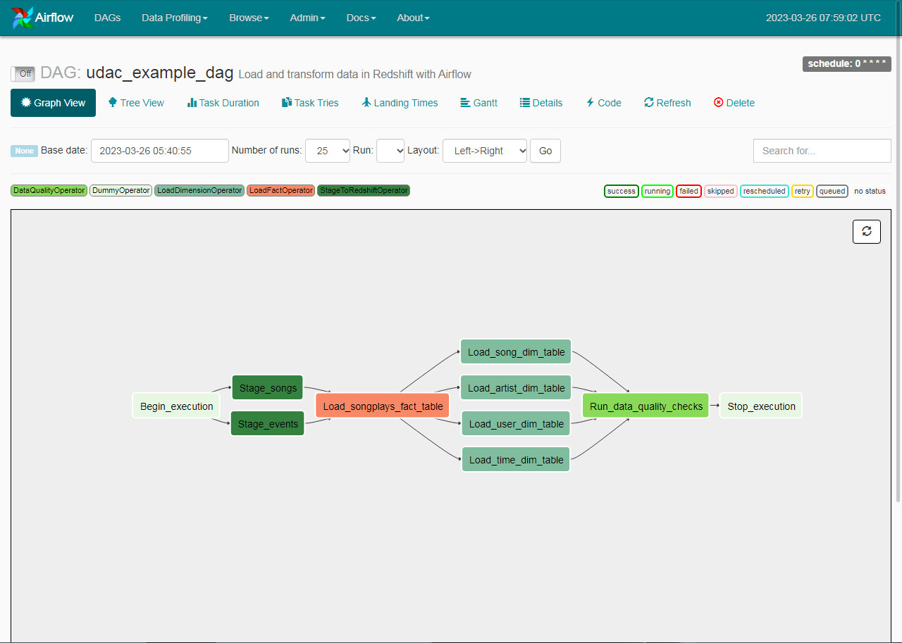
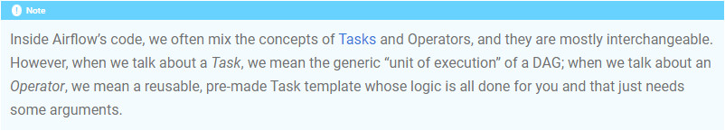

# Project: Data Pipelines with Airflow

 

This project is considered as an extension of the Project: Data Warehouse, the 3rd project of the Data Engineering Nanodegree program. It shares the same purpose and analytical goals in context of the company Sparkify, as well as the design of database schemas, and even the ETL pipelines. These two projects are considered to be **functionally equivalent** implementations of the same ETL task, but with only one difference : in this project, the original Python program codes are modified to make them workable in [Apache Airflow](https://airflow.apache.org/), a platform created to focus on scheduling and monitoring workflows, especially data pipelines.

The way we create the data pipelines in the 3rd project can do the work we need, but it may not suitable for the production use in the long run, because

- Logging messages during execution of data pipelines would be a little inconvenient in this way. We would have to explicitly instruct the program (or task schedulers like crontab) to log messages generated to some text files in the filesystem. And, we'll need to store these log files in a way we can efficiently retrieve them later for analysis.
- Monitoring execution of data pipelines during runtime would also be kind of bothering in this way. Scripts like these will show no progress during execution, scheduled or not, since scripts by nature are not designed to be an interactive program. The best bet we can do is to follow the output of program log files in real time (eg. [tail](https://www.linuxfoundation.org/blog/blog/classic-sysadmin-14-tail-and-head-commands-in-linux-unix) command in Unix/Linux), but it would become exhausting when the number of the scripts increases.
- Maintaining different versions of data pipelines could be troublesome. We may have difficulties to recall the actual structure of the data pipelines without some extra documentations (another time-consuming task) after several weeks or months, not mentioning the efforts to preserve or rerun them when necessary.

The good news is, Airflow can handle these troubles effectively, but we will have to port the ETL logics in the scripts to Airflow platform first.

 

Data pipelines are data processing steps carried out in specific order, and this is also true when we are creating them in Airflow platform. In Airflow, data pipelines will be represented as a [Directed Acyclic Graph](https://en.wikipedia.org/wiki/Directed_acyclic_graph) (or DAG for short), with individual tasks as *nodes*, and required sequences of task executions as *edges with directions*. And we are not drawing a graph from scratch - all we need to do is to write Python codes that can be understood by Airflow, and Airflow will take care of the rest. When the appropriate Python codes of a DAG are parsed by Airflow, we should be able to see something like this in its web interface:

That's prettier than most of the old-school style task scheduling and monitoring tools, and it's interactive, too.

To get Airflow up to work, we will have to write program codes to represent a DAG, its related nodes, and edges in Python. As shown in the file [**airflow/dags/udac_example_dag.py**](https://github.com/ZXKUQYB/nd027-project5/blob/main/airflow/dags/udac_example_dag.py), defining a DAG and edges are straightforward, but defining tasks may be a little more complex than that. To properly define a task in Airflow, we will need to use an Airflow [operator](https://airflow.apache.org/docs/apache-airflow/stable/core-concepts/operators.html) to define a task and supply it with necessary arguments. And if the built-in operators are not sufficient to represent the program logic, we may have to create [our own operators](https://airflow.apache.org/docs/apache-airflow/stable/howto/custom-operator.html) from scratch ([here](https://docs.astronomer.io/learn/airflow-importing-custom-hooks-operators) and [here](https://blog.devgenius.io/writing-custom-operators-and-hooks-for-mwaa-c8a1b6052553) are some examples).

>Note : as stated in a note of the Airflow online docs, the term **Tasks** and **Operators** are usually treated as the same "thing", but we should still be aware of the differences between them.

In this project we will create four custom operators to divide the original monolithic ETL script into smaller, more atomic units of work, so as to keep them easier to maintain. These custom operators are briefly described as follows:

- StageToRedshiftOperator : Load JSON files from S3 to Redshift
- LoadFactOperator : Load and transform data into fact table
- LoadDimensionOperator : Load and transform data into dimension table
- DataQualityOperator : Run quality checks on the loaded data

These custom operators can be found in the [**airflow/plugins/operators**](https://github.com/ZXKUQYB/nd027-project5/tree/main/airflow/plugins/operators) directory.

 

Although we are using custom operators due to the requirements of the project, it is likely that most if not all of the custom operators in this project are unnecessary, and could be replaced by operators supplied by Airflow [provider packages](https://airflow.apache.org/docs/apache-airflow-providers/index.html). For example, AWS also release their own [provider package](https://airflow.apache.org/docs/apache-airflow-providers-amazon/stable/index.html) into Airflow community, and it seems that most of the data processing tasks related to Redshift can also be accomplished by using official AWS operators like [this](https://airflow.apache.org/docs/apache-airflow-providers-amazon/stable/operators/redshift_data.html) and [this](https://airflow.apache.org/docs/apache-airflow-providers-amazon/stable/operators/redshift_sql.html).

As a final note, this project assumes the previous Redshift cluster we deployed is still available (along with the tables we created earlier in Project: Data Warehouse), therefore if these related tables have been dropped, we will have to create them again before testing this project with Airflow.
